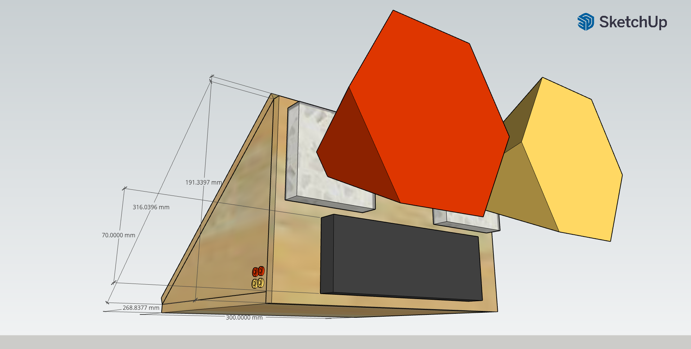
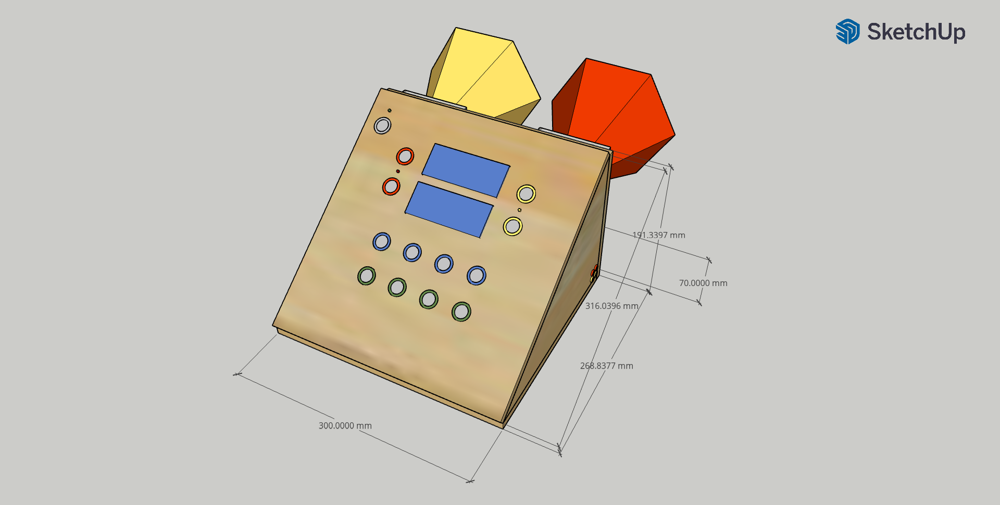
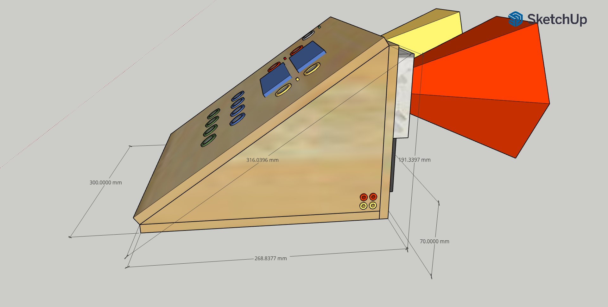
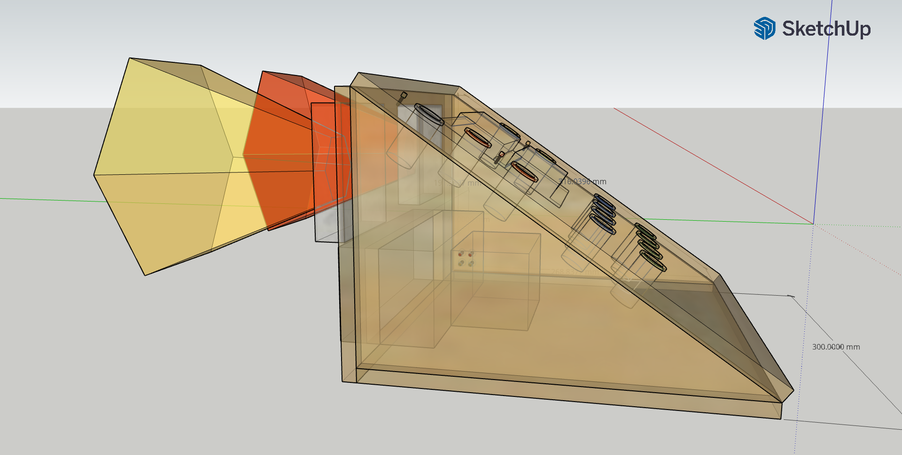

<!-- markdown-toc start - Don't edit this section. Run M-x markdown-toc-refresh-toc -->
**Table of Contents**

- [Hardware](#hardware)
    - [Global Schematics](#global-schematics)
    - [Ready to solder PCB](#ready-to-solder-pcb)
- [Construction](#construction)
    - [Global design](#global-design)
    - [Components](#components)
- [Installation](#installation)

<!-- markdown-toc end -->


## Hardware

### Global Schematics

Sources for global schematics are [here](./kicad/board)


### Ready to solder PCB

Sources for ready-to-solder PCB are [here](./kicad/pcb)


## Construction

### Global design

Sources for desk design are [here](./sketcup)






### Components

- 22.99€,  3 x LCD displays: https://www.amazon.fr/dp/B07V5K3ZVB?ref=ppx_yo2ov_dt_b_product_details&th=1
- 8.99€,  15 x 3.3V to 5V signal converter: https://www.amazon.fr/dp/B082F6BSB5?psc=1&ref=ppx_yo2ov_dt_b_product_details
- 8.58€,   1 x LED kit: https://www.amazon.fr/dp/B08S2W74K7?ref=ppx_yo2ov_dt_b_product_details&th=1
- 10.99€,  1 x Flat cable: https://www.amazon.fr/dp/B082WZC56B?psc=1&ref=ppx_yo2ov_dt_b_product_details
- 11.99€,  1 x Connector kit: https://www.amazon.fr/dp/B089LZ14WB?psc=1&ref=ppx_yo2ov_dt_b_product_details
- 66.50€,  1 x Rasberry PI 4 model B: https://www.kubii.com/en/raspberry-pi-boards/2772-raspberry-pi-4-model-b-4gb-3272496309333.html
- 7,49 €,  1 x 16GB microSD: https://www.amazon.fr/dp/B07DVG12SF?psc=1&ref=ppx_yo2ov_dt_b_product_details
- 18.59€,  1 x USB Speader: https://www.amazon.fr/Umitive-Haut-Parleur-dOrdinateur-Compatibilit%C3%A9-Antid%C3%A9rapante/dp/B08JTRML6R/ref=sr_1_7?keywords=enceinte+usb&qid=1697275415&sr=8-7
- 38,27€, 13 x Custom made 5v LED push switches: https://fr.aliexpress.com/item/4000098893464.html?spm=a2g0o.order_list.order_list_main.10.21ef5e5b7tX8DX&gatewayAdapt=glo2fra


## Installation

Sources for software are [here](./bquiz)


- Enable primary I2C port (/dev/i2c-1)

```
$ sudo raspi-config
(select 3. Interface options)
(select I5. I2C)
(select yes)
```

- Enable secondary I2C port (/dev/i2c-0)

```
cat /boot/config.txt
...
dtparam=i2c_arm=on
dtparam=i2c_vc=on
...
```

- Check I2C ports

```
 # package to test gpio port
 sudo apt install i2c-dev i2c-tools

 # check i2c ports, should have 27 on
 i2cdetect -y 1
 i2cdetect -y 0
```

- Install sound support

```
 sudo apt-get install pulseaudio pulseaudio-utils python3-vlc
```

- Configure default pulseaudio sink

```
 pactl set-default-sink alsa_output.usb-C-Media_Electronics_Inc._USB_Audio_Device-00.analog-stereo
```

- Install software as user startup service

```
 # install bquiz cli to ~/.local/bin
 python3 -m pip install .

 # install user systemd unit
 mkdir -p ~/.config/systemd/user
 ln -s $(pwd)/systemd/user/bquiz.service ~/.config/systemd/
 systemctl --user enable bquiz.service

 # run bquiz
 systemctl --user start bquiz.service
```
