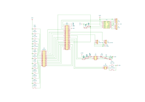
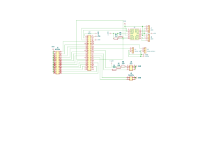
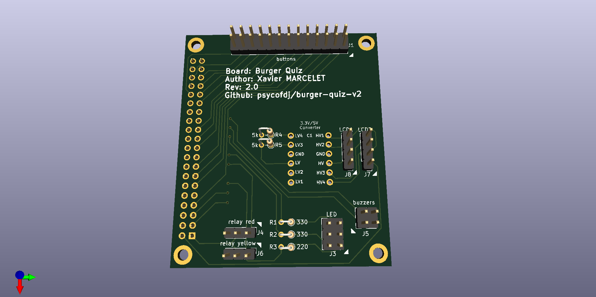
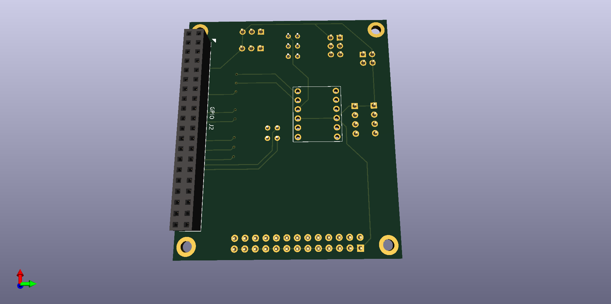

## Hardware

### Global Schematics



### Ready to solder PCB








## Installation

- Enable primary I2C port (/dev/i2c-1)

```
$ sudo raspi-config
(select 3. Interface options)
(select I5. I2C)
(select yes)
```

- Enable secondary I2C port (/dev/i2c-0)

```
cat /boot/config.txt
...
dtparam=i2c_arm=on
dtparam=i2c_vc=on
...
```

- Check I2C ports

```
# package to test gpio port
sudo apt install i2c-dev i2c-tools

# check i2c ports, should have 27 on
i2cdetect -y 1
i2cdetect -y 0
```

- Install sound support

```
sudo apt-get install pulseaudio pulseaudio-utils python3-vlc
```

- Configure default pulseaudio sink

```
pactl set-default-sink alsa_output.usb-C-Media_Electronics_Inc._USB_Audio_Device-00.analog-stereo
```

- Install software as user startup service

```
# install bquiz cli to ~/.local/bin
python3 -m pip install .

# install user systemd unit
mkdir -p ~/.config/systemd/user
ln -s $(pwd)/systemd/user/bquiz.service ~/.config/systemd/
systemctl --user enable bquiz.service

# run bquiz
systemctl --user start bquiz.service
```
